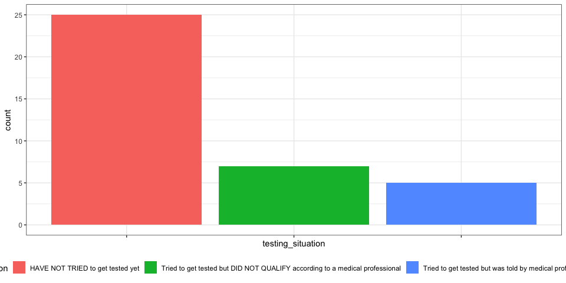

Analysis of fake data
================
Brian Barkley
4/2/2020

<!-- # Load fake data -->

<!-- ## Cleaning raw data -->

<!-- ### Filter some of the bad rows -->

<!-- ### create easier variables -->

## Initial data views

  - This data has 99 rows and 51 columns.

### Zip codes

This is a subset of the total data; it is very long-tailed.

| ZIP   | number\_reporting\_illness |
| :---- | :------------------------- |
| NA    | 57                         |
| 92617 | \<= 4                      |
| 28787 | \<= 4                      |
| 43085 | \<= 4                      |
| 53209 | \<= 4                      |
| 53213 | \<= 4                      |
| 54665 | \<= 4                      |
| 01532 | \<= 4                      |

### Gender

| gender |  n |
| :----- | -: |
| NA     | 56 |
| Female | 33 |
| Male   | 10 |

### Duration of illness

Duration of illness at time of survey response. This does not yet adjust
for the timestamp on the response.

| days\_sick     | number\_respondents |
| :------------- | :------------------ |
| 7 or more days | 16                  |
| 6 days         | \<= 4               |
| 5 days         | \<= 4               |
| 4 days         | 6                   |
| 3 days         | 5                   |
| 2 days         | 9                   |
| 1 day          | \<= 4               |
| NA             | 53                  |

### COVID-19 testing status / situation

Respondant’s COVID-19 test status at time of the survey response, for
those who reported being
sick.

| testing\_situation                                                          | number\_respondents |
| :-------------------------------------------------------------------------- | :------------------ |
| HAVE NOT TRIED to get tested yet                                            | 25                  |
| Tried to get tested but DID NOT QUALIFY according to a medical professional | 7                   |
| Tried to get tested but was told by medical professional to STAY HOME       | 5                   |
| NA                                                                          | \<= 4               |
| Other                                                                       | \<= 4               |
| Tested and WAITING for results                                              | \<= 4               |
| Tested and NEGATIVE                                                         | \<= 4               |
| Tested and POSITIVE                                                         | \<= 4               |

<!-- -->
